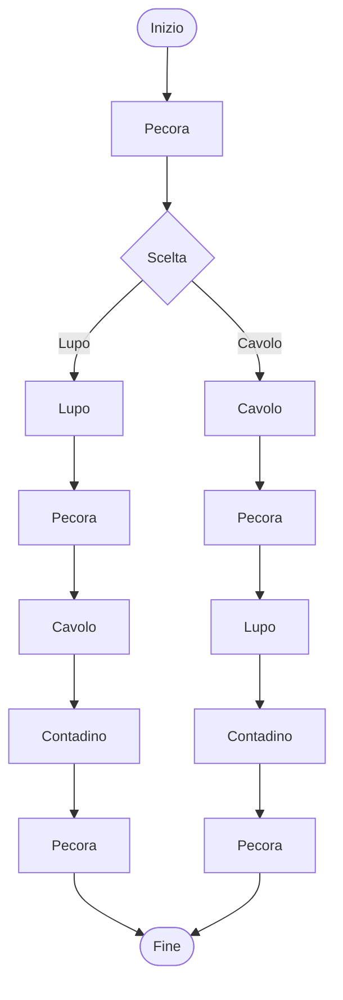

<h1 align="center">Enigma</h1>

Sulla sponda di un fiume sono presenti un contadino, un lupo, una pecora, un cavolo. <br>In presenza del contadino non ci sono problemi ma, senza di lui, la pecora mangia il cavolo e il lupo mangia la pecora. Il contadino deve trasportare i tre elementi sulla sponda opposta del fiume, ma può trasportarne solo uno per volta. 

---
**Presentazione** <br> 
Lo scopo di questo progetto è quello di realizzare una simulazione dell'enigma del "lupo, pecora e cavolo", reinterpretandolo come un sistema basato sui concetti fondamentali dei sistemi operativi e della gestione dei processi. 

Utilizzeremo l'indovinello come modello, considerando ogni elemento del problema come una componente indipendente del sistema. Il contadino assume il ruolo di processo principale (controller), responsabile del coordinamento dell'intera simulazione, mentre il lupo, la pecora e il cavolo vengono modellati come processi figli, ognuno dotato di un proprio ciclo di vita e di uno stato, quindi un processo padre controlla e coordina l'esecuzione di più processi subordinati.

In ogni istante sarà necessario: 
- conoscere la posizione di ogni elemento 
- verificare la validità delle operazioni richieste 
- controllare che vengano rispettate le regole del problema. 
Sarà quindi possibile determinare se una determinata configurazione rappresenta uno stato valido oppure una situazione di errore.
---
**Avvio del progetto** <br>
```bash
git clone https://github.com/robertaconti2506/formazione_sou.git
cd formazione_sou/Enigma
```

**Esecuzione tramite Docker** <br>
La scelta di utilizzare un ambiente Docker, come spiegato successivamente, è stata fatta per garantire un ambiente isolato e riproducibile.
Dalla directory principale del progetto:
```bash
docker build -t enigma-lupo-pecora-cavolo -f Containerfile .
```

Eseguire poi il file bash
```bash
./run-docker.sh
```
in questo modo il container avvia automaticamente il processo principale (`contadino.sh`) e i relativi processi figli. 

---
**Architettura** <br>
L'intera applicazione sarà portabile, eseguita all'interno di un ambiente containerizzato.

Il processo principale avrà il compito di 
- inizializzare il sistema 
- creare processi figli 
- gestire il ciclo di esecuzione della simulazione 
- coordinare tutte le operazioni del gioco
I processi figli non prenderanno decisioni in maniera autonoma, ma rimarranno in uno stato di attesa fino alla ricezione di un'azione da parte del controller. 

Per rappresentare la configurazione corrente del sistema verrà mantenuto un file di stato condiviso (`shared_state.env`) contenente la posizione di ciascun elemento del problema. Ogni modifica dello stato sarà sottoposta ad una fase di validazione, nella quale verrà verificato il rispetto dei vincoli del problema, evitando la generazione di configurazioni non consentite. 

L'applicazione seguirà un ciclo di esecuzione iterativo, ad ogni iterazione il controller riceverà una richiesta di movimento, ne verificherà la validità, aggiornerà lo stato globale del sistema e comunicando ai processi coinvolti il cambiamento, successivamente verrà eseguito il controllo.
La comunicazione tra controller e processi figli avverrà tramite segnali POSIX (`SIGUSR1` per notificare un aggiornamento e `SIGTERM` per terminare il processo).

Per l'implementazione verranno utilizzati script Bash: 
- creazione dei processi 
- la loro identificazione tramite PID 
- la sincronizzazione dell'esecuzione 
- l'attesa di eventi 
- la comunicazione tra le diverse componenti.

L'intero ambiente di esecuzione sarà distribuito mediante Docker. Il container conterrà tutti gli script necessari all'avvio della simulazione e garantirà che il comportamento dell'applicazione rimarrà invariato indipendentemente dal sistema operativo dell'utilizzatore.

--- 
**Elementi chiave** <br>
- un solo container Docker
- Bash come linguaggio principale
- controller = contadino = processo padre (root)
- lupo, pecora, cavolo = processi figli 
- interazione da terminale 
- shared state modificabile solo dal controller 
- system.log che registra gli aggiornamenti ricevuti dai processi figli

---
**Flusso di gioco** <br>
Inizialmente viene mostrato lo stato corrente del sistema, indicando la posizione del contadino, del lupo, della pecora e del cavolo, l'utente sceglie poi la mossa da riga di comando, se non è valida comparirà un messaggio di errore e verrà chiesto un nuovo input senza modificare lo stato del sistema. Se la mossa è valida, viene aggiornato il file "Shared State" e registrata l'operazione nel system.log, viene poi controllata la "regolarità" delle azioni e la conclusione, l'utente scoprirà se ha vinto e quindi se tutti gli elementi sono stati trasportati sulla sponda opposta.
Inizialmente viene mostrato lo stato corrente del sistema, indicando la posizione del contadino, del lupo, della pecora e del cavolo, l'utente sceglie poi la mossa da riga di comando, se non è valida comparirà un messaggio di errore e chiede un nuovo input senza modificare lo stato del sistema. Se la mossa è valida, viene aggiornato lo "Shared State" e registrata l'operazione nel system.log (durante l'esecuzione della simulazione, i processi generano eventi che vengono registrati nel file: logs/system.logs, creato e aggiornato durante l'esecuzione), viene poi controllata la "regolarità" delle azioni e la conclusione, l'utente scoprirà se ha vinto e quindi se tutti gli elementi sono stati trasportati sulla sponda opposta.

---
**Elementi del sistema**

| Componente                | Ruolo               | Funzione                                                                                                               |
| ------------------------- | ------------------- | ---------------------------------------------------------------------------------------------------------------------- |
| Utente                    | Utilizzatore        | Mosse tramite CLI                                                                                                      |
| Controller -<br>Contadino | Processo principale | Coordina i processi,<br>Valida le mosse<br>Aggiorna lo Shared State<br>Scrive i log<br>Verifica le condizioni di gioco |
| Lupo                      | Processo figlio     | Esegue le operazioni richieste                                                                                         |
| Pecora                    | Processo figlio     | Esegue le operazioni richieste                                                                                         |
| Cavolo                    | Processo figlio     | Esegue le operazioni richieste                                                                                         |
| Shared State              | Stato condiviso     | Contiene la posizione corrente di tutti gli elementi del sistema                                                       |
| system.log                | Registra eventi     | Memorizza gli aggiornamenti ricevuti dai processi figli in seguito ai segnali inviati dal controller                   |

---
**Soluzione**


---

