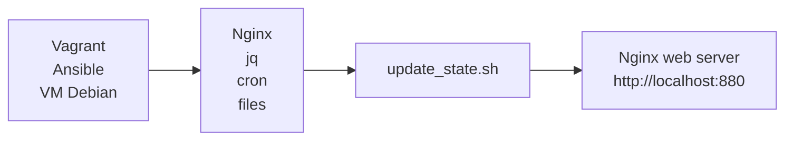

<h1 align="center">Coffee --status</h1>

## devops_everywhere 

#### Il progetto consiste in una pagina web in cui troviamo una dashboard rappresentante lo stato della macchina del caffè aziendale. 


#### Flusso di provisioning e deployment


#### Prerequisiti
##### Per poter avviare e replicare correttamente il progetto è necessario disporre di:
- Oracle VirtualBox
- Vagrant
- Ansible 
- CPU: 1 core
- RAM: 1 GB
- 6 GB di spazio libero su disco 


Per quanto riguarda gli altri servizi necessari, Nginx, jq e cron, verranno installati automaticamente tramite provisioning (in questo caso con Ansible) 

#### Per avviare l'infrastruttura di rete
```bash
git clone https://github.com/robertaconti2506/formazione_sou.git
cd formazione_sou/devops_everywhere
vagrant up
```

#### Descrizione del progetto
Lo scopo di questo progetto è quello di realizzare un ambiente portabile. <br>Ho scelto come provisioner "Ansible" e come server web "Nginx". Ho inserito poi "jq" per evitare semplici problemi con il file JSON e "cron" per eseguire automaticamente lo script bash ogni minuto (per mostrare lo stato della macchina del caffè aggiornato). <br>Troverete quindi il Vagrantfile, con configurazione base, il playbook per il provisioning e lo script bash con il file HTML, che ho deciso di separare dal playbook per una maggiore leggibilità.</b>Ho aggiunto anche dei controlli sulla macchina del caffè per rendere il progetto più realistico, se il valore del caffè o dell'acqua scendono a zero, dopo un minuto in OFF, riparte dallo stato iniziale (verosimilmente è stata aggiunta dell'acqua o del caffè), allo stesso modo se la temperatura o il numero di cups supera un certo limite. 
