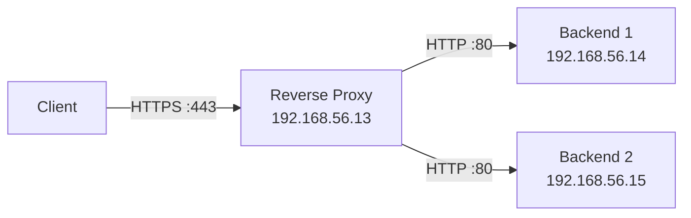

<h1 align="center">Reverse proxy</h1>

#### Il progetto consiste in un'infrastruttura di rete composta da tre macchine virtuali: un reverse proxy e due backend. <br> Il reverse proxy (HAProxy) riceve e gestisce le richieste del client sia HTTPS che HTTP (perchè il traffico HTTP viene reindirizzato verso HTTPS, come possiamo verificare nel file haproxy.cfg), inoltra poi tali richieste ai backend tramite HTTP, i backend infatti non hanno contatti diretti con il client. <br> I servizi utilizzati sono HAProxy e Nginx, con meccanismi di sicurezza basati su ACL (in haproxy) e firewall (ufw sui backend). <br> I dettagli delle configurazioni sono nei file di provisioning.

## Architettura di rete
| Nome VM |Sistema operativo| IP | Ruolo | Servizi |Porta (interna VM) | Accesso consentito |
|---------|------------------|----|-------|---------|-------------------|--------------------|
|proxyrev|ubuntu 22.04.5 LTS <br> (Jammy Jellyfish)|192.168.56.13|Reverse proxy|HAProxy|80/443|client <br> (tramite https)|
|backserver1|ubuntu 22.04.5 LTS <br> (Jammy Jellyfish)|192.168.56.14|Backend|Nginx|80|Solo proxyrev (http)|
|backserver2|ubuntu 22.04.5 LTS <br> (Jammy Jellyfish)|192.168.56.15|Backend|Nginx|80|Solo proxyrev (http)|


#### Flusso del traffico


#### Prerequisiti
##### Per poter avviare e replicare correttamente l’infrastruttura è necessario disporre di:
- Oracle VirtualBox
- Vagrant
- CPU: 4 core
- RAM: 6 GB
- 10 GB di spazio libero su disco
- password utente predefinito delle VM: vagrant

Per quanto riguarda gli altri servizi necessari, HAProxy e Nginx, verranno installati automaticamente tramite gli script di provisioning

#### Per avviare l'infrastruttura di rete
```bash
git clone https://github.com/robertaconti2506/formazione_sou.git
cd formazione_sou/reverse-proxy-haproxy
vagrant up
```
#####

#### Verifiche da host  
```bash
vagrant status # tutte le VM devono avere come stato "running (virtualbox)"
curl -k https://localhost:18443/ # da ripetere più volte per verificare roundrobin (attesi output alternati)
curl -k https://localhost:18443/backend1 # output atteso: pagina HTML restituita da backend 1
curl -k https://localhost:18443/backend2 # output atteso: pagina HTML restituita da backend 2
curl -k http://192.168.56.14 # output atteso: nessuno o errore (configurazioni di sicurezza ACL e firewall)
curl -k http://192.168.56.15 # output atteso: nessuno o errore (configurazioni di sicurezza ACL e firewall)
curl -I http://localhost:18081 # output atteso: Moved Permanently, indica la nuova location (https)
```
#### Verifiche da proxyrev
```bash
vagrant ssh proxyrev
sudo systemctl status haproxy # output atteso: active (running)
sudo ss -tlnp | grep haproxy # listen ports, output atteso: :80, :443
ping -c 4 192.168.56.14  # raggiungibilità backend 1
curl http://192.168.56.14/ # testa risposta servizio web, backend 1
ping -c 4 192.168.56.15  # raggiungibilità backend 2
curl http://192.168.56.15/ # testa risposta servizio web, backend 2
```

#### Verifiche da backend1
 ```bash
 vagrant ssh backserver1
 ping -c 4 192.168.56.13 # raggiungibilità del reverse proxy
 curl http://192.168.56.13 # nessun output, ma per verificare che non dia output di errore
 ```

#### Verifiche da backend2
 ```bash
 vagrant ssh backserver2
 ping -c 4 192.168.56.13 # raggiungibilità del reverse proxy
 curl http://192.168.56.13 # nessun output, ma per verificare che non dia output di errore
 ```
